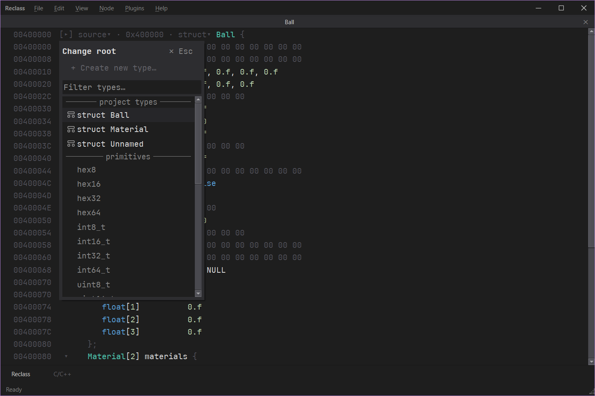

# ReclassX

A hex editor for reading live process memory. It shows structs, pointers, arrays, and padding so you can see how data is laid out and how it connects.

An improvement over other reclass like editors.

Work in progress.



## Build

Requires Qt 6, QScintilla, and MinGW on Windows.

```
cmake -B build -G Ninja
cmake --build build
```
