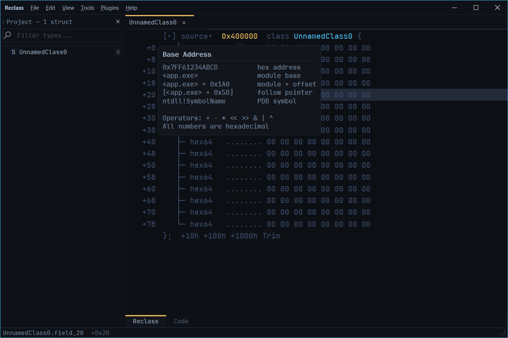
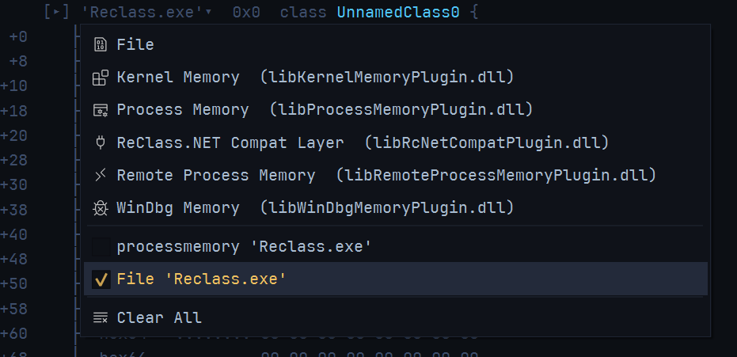

<div align="center">

<picture>
  <source media="(prefers-color-scheme: dark)" srcset="docs/RECLASS_LIGHTMODE.svg" height="170">
  
</picture>

**A structured binary editor for reverse engineering — inspect raw bytes as typed structs, arrays, and pointers.<p>Built from scratch as a modern replacement for ReClass.NET and ReClassEx**

[Download](https://github.com/IChooseYou/Reclass/releases) · [Build Instructions](#build) · [Kernel Driver](#kernel-driver) · [MCP Integration](#mcp-integration) · [Alternatives](#alternatives)

[](https://github.com/IChooseYou/Reclass/actions/workflows/build.yml)
[](LICENSE)
[](https://github.com/IChooseYou/Reclass/releases)
[]()

</div>

Reclass helps you inspect raw bytes and interpret them as types (structs, arrays, primitives, pointers, padding) instead of just hex. It is a debugging tool for figuring out unknown data structures — either at runtime from a live process, or from a static source like a binary file or crash dump.

Built with C++17, Qt 6 (Qt 5 also supported), and QScintilla. The entire editor surface is rendered as formatted plain text with inline editing, fold markers, and hex/ASCII previews.

## Screenshots






## Features

### Editor

- **Structured binary view** — render raw bytes as typed fields with columnar alignment
- **Inline editing** — click to edit type names, field names, values, base addresses, array metadata, pointer targets, enum members, bitfield members, static expressions, and comments — all with real-time validation
- **Tab-cycling** — tab through editable fields within a line
- **Type autocomplete** — cached popup type picker with search/filter for struct targets
- **Multi-select** — Ctrl+click individual nodes or Shift+click for range selection
- **Split views** — multiple synchronized editor panes over the same document
- **Find bar** — Ctrl+F in-editor search with indicator highlighting
- **Fold/collapse** — expand and collapse structs, arrays, and pointer expansions with embedded fold indicators
- **Hex + ASCII columns** — raw byte previews alongside the structured view with per-byte change highlighting

### Live Memory Analysis

- **Auto-refresh** — configurable interval (default 660ms) with async page-based reads for non-blocking UI
- **Value history & heatmap** — per-node ring buffer (10 samples with timestamps), color-coded heat indicators (static/cold/warm/hot) based on change frequency
- **Changed-byte highlighting** — per-byte change indicators within hex preview lines
- **Memory write-back** — edit values inline, writes propagate through the provider to live process memory
- **Pointer chasing** — automatic reads of dereferenced memory regions across pointer chains
- **Address parser** — formula expressions like `<module.exe>+0x1A0`, pointer dereference chains, symbol resolution

### Undo / Redo

Full command stack with 15 undoable operations: ChangeKind, Rename, Collapse, Insert, Remove, ChangeBase, WriteBytes, ChangeArrayMeta, ChangePointerRef, ChangeStructTypeName, ChangeClassKeyword, ChangeOffset, ChangeEnumMembers, ChangeOffsetExpr, ToggleStatic. Batch macro support for multi-node operations.

### Import / Export

| Format | Import | Export |
|--------|:------:|:------:|
| **Native JSON (.rcx)** | Full tree + metadata | Full tree + metadata |
| **C/C++ source** | Struct/class/union/enum parsing with offset comments | Header generation with optional static asserts |
| **ReClass XML** | Full compatibility with ReClass Classic | Full compatibility |
| **PDB symbols (Windows)** | UDT enumeration with selective recursive import via raw_pdb — no DIA SDK dependency | |

### Workspace & Navigation

- **Multi-document tabs** — MDI interface, one document per tab
- **Workspace dock** — project explorer tree with struct/enum/union icons, sorted by field count, quick navigation to members
- **Scanner dock** — integrated memory search panel
- **Dual view mode** — switch between ReClass tree view and rendered C/C++ output per tab
- **View root** — focus on a specific struct, hiding all others
- **Scroll to node** — programmatic navigation to any node by ID

## Data Sources

- **File** — open any binary file and inspect its contents as structured data
- **Process** — attach to a live process and read its memory in real time (Windows/Linux)
- **Kernel driver** — Windows kernel driver (IOCTL) for process memory, physical memory, page table walking, and CR3/VTOP translation (see [Kernel Driver](#kernel-driver) below)
- **Remote Process** — read another process's memory over TCP with cross-architecture 32/64-bit support
- **WinDbg** — connect to live WinDbg debugging sessions or load crash dumps
- **Saved sources** — quick-switch between recently used data sources per tab

## Plugin System

DLL plugins loaded from a `Plugins` folder, auto or manual.

**Bundled plugins:**

| Plugin | Description |
|--------|-------------|
| **Process memory** | Attach to local processes on Windows and Linux — PID-based, with symbol resolution and module/region enumeration |
| **Kernel memory** | Windows kernel driver (IOCTL) for reading/writing process and physical memory, CR3 queries, virtual-to-physical translation, and full 4-level page table walking — supports 4KB, 2MB, and 1GB pages |
| **WinDbg** | Access data from live WinDbg debugging sessions |
| **Remote process memory** | TCP RPC-based remote process access with cross-architecture support |
| **ReClass.NET compatibility** | Load existing ReClass.NET native DLL plugins directly; optional .NET CLR hosting for managed plugins |

## MCP Integration

Built-in [Model Context Protocol](https://modelcontextprotocol.io/) bridge via `ReclassMcpBridge` — the first reverse engineering tool with native AI/LLM integration. The server uses JSON-RPC 2.0 over named pipes and can be toggled from the Tools menu or auto-started on launch.

**Available tools:**

| Tool | Description |
|------|-------------|
| `projectState` | Read current tree structure, base address, tab state |
| `treeApply` | Apply structural command deltas to the node tree |
| `sourceSwitch` | Switch the active data source |
| `hexRead` | Read bytes at an address |
| `hexWrite` | Write bytes at an address |
| `statusSet` | Update the status bar text |
| `uiAction` | Trigger menu actions programmatically |
| `treeSearch` | Search nodes by name or type |
| `nodeHistory` | Query value change history for a node |

**Notifications:** `notifyTreeChanged`, `notifyDataChanged`

A standalone stdio-to-pipe bridge binary is built alongside the main application. To connect, add this to your MCP client config (e.g. `.mcp.json`):

```json
{
  "mcpServers": {
    "ReclassMcpBridge": {
      "command": "path/to/build/ReclassMcpBridge",
      "args": []
    }
  }
}
```

## Kernel Driver

The **Kernel Memory** plugin (`plugins/KernelMemory`) provides a Windows kernel driver for low-level memory access via IOCTL. It bypasses user-mode API limitations and works on protected/anti-cheat processes.

### Capabilities

- **Process memory** — read/write via `MmCopyVirtualMemory()` (no `KeAttachProcess` deadlock risk), up to 1 MB per operation
- **Physical memory** — read/write via MDL-based safe mapping with proper cache type handling (RAM and MMIO), up to 4 KB per operation
- **CR3 query** — read DirectoryTableBase from EPROCESS for any process
- **Virtual-to-physical (VTOP)** — full 4-level page table walk (PML4 → PDPT → PD → PT) with 4 KB, 2 MB, and 1 GB page support
- **Page table reading** — read arbitrary page table entries from physical addresses
- **Process enumeration** — list running processes with module paths
- **Module enumeration** — walk PEB→Ldr InLoadOrderModuleList for any process
- **Thread enumeration** — query all TEBs for a process
- **Region enumeration** — `ZwQueryVirtualMemory()` for virtual memory layout

### Building the Driver

Requires Visual Studio 2022 and the Windows Driver Kit (WDK 10.0.19041+). Test signing must be enabled:

```
bcdedit /set testsigning on
```

Build with the included script:

```bash
cd plugins/KernelMemory/driver
build_driver.bat
```

This produces `driver/build/rcxdrv.sys`. Copy it to `Plugins/rcxdrv.sys` next to the plugin DLL. The plugin manages the kernel service (`RcxDrv`) automatically via SCM — it creates, starts, and stops the service as needed.

### Architecture

```
Reclass.exe
  └─ KernelMemoryPlugin.dll     (user-mode plugin)
       └─ DeviceIoControl()      (\\.\RcxDrv)
            └─ rcxdrv.sys        (kernel-mode WDM driver)
```

The driver creates `\Device\RcxDrv` and communicates exclusively through `METHOD_BUFFERED` IOCTLs. All kernel operations use SEH and validated input/output buffers.

## Build

### Prerequisites

- **Qt 6** (or Qt 5) with MinGW — [Qt Online Installer](https://doc.qt.io/qt-6/qt-online-installation.html) (select MinGW kit + CMake/Ninja from the Tools section)
- **CMake 3.20+** — [cmake.org](https://cmake.org/download/) (bundled with Qt)
- **Ninja** — bundled with the Qt installer

### Quick Build

```bash
git clone --recurse-submodules https://github.com/IChooseYou/Reclass.git
cd Reclass
.\scripts\build_qscintilla.ps1
.\scripts\build.ps1
```

The build script auto-detects your Qt install location.

### macOS Build

```bash
./scripts/build_macos.sh --qt-dir /opt/homebrew/opt/qt --build-type Release --package
```

If you installed Qt via Homebrew, `--qt-dir /opt/homebrew/opt/qt` is typical on Apple Silicon. You can also set `QTDIR` or `Qt6_DIR` instead of passing `--qt-dir`.

Note: macOS Gatekeeper may block unsigned apps. If the app won't open, go to **System Settings > Privacy & Security** and click **Open Anyway**.

### Manual Build (MinGW)

1. Clone with `--recurse-submodules` (or run `git submodule update --init --recursive` after cloning)
2. Build QScintilla: `qmake` + `mingw32-make` in `third_party/qscintilla/src`
3. Configure and build:
   ```bash
   cmake -B build -G Ninja -DCMAKE_PREFIX_PATH=/path/to/Qt/6.x.x/mingw_64
   cmake --build build
   ```
4. Optionally run `windeployqt` on the output executable

### Visual Studio 2022+

The `msvc/` folder contains a ready-made solution (`Reclass.slnx`) with projects for the main application, all plugins, and third-party libraries. Requires the [Qt Visual Studio Tools](https://marketplace.visualstudio.com/items?itemName=TheQtCompany.QtVisualStudioTools2022) extension with a Qt 6 MSVC kit configured.

### Running Tests

```bash
ctest --test-dir build --output-on-failure
```

30 tests covering composition, serialization, undo/redo, import/export, provider switching, type visibility, validation, scanning, and rendering.

## Alternatives

- [ReClass.NET](https://github.com/ReClassNET/ReClass.NET)
- [ReClassEx](https://github.com/ajkhoury/ReClassEx)

<div align="center">
<sub>MIT License</sub>
</div>
