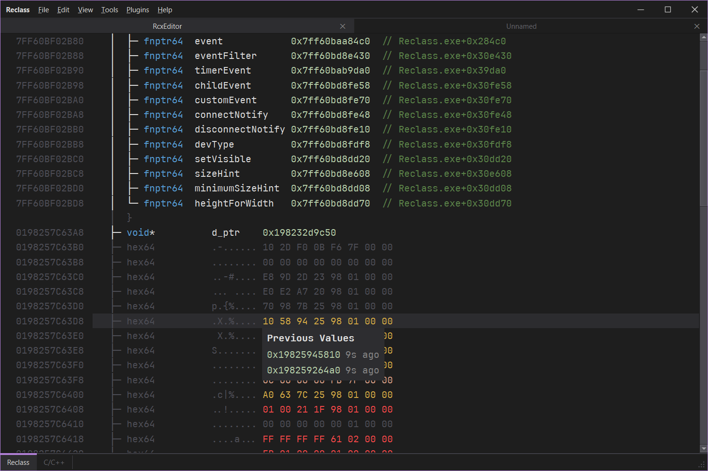
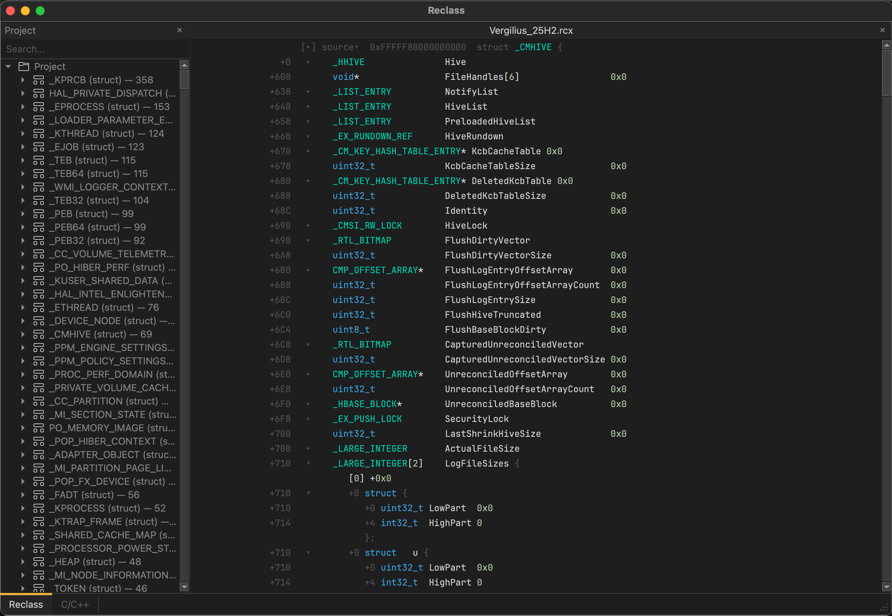
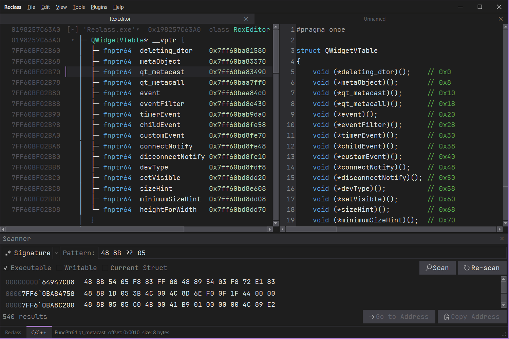

<div align="center">

<picture>
  <source media="(prefers-color-scheme: dark)" srcset="docs/RECLASS_LIGHTMODE.svg" height="170">
  
</picture>

**A structured binary editor for reverse engineering — inspect raw bytes as typed structs, arrays, and pointers.<p>Built from scratch as a modern replacement for ReClass.NET and ReClassEx**

[Download](https://github.com/IChooseYou/Reclass/releases) · [Build Instructions](#build) · [MCP Integration](#mcp-integration) · [Alternatives](#alternatives)

[](https://github.com/IChooseYou/Reclass/actions/workflows/build.yml)
[](LICENSE)
[](https://github.com/IChooseYou/Reclass/releases)
[]()

</div>

Reclass helps you inspect raw bytes and interpret them as types (structs, arrays, primitives, pointers, padding) instead of just hex. It is essentially a debugging tool for figuring out unknown data structures — either at runtime from a live process, or from a static source like a binary file or crash dump.

Built with C++17, Qt 6 (Qt 5 also supported), and QScintilla. The entire editor surface is rendered as formatted plain text with inline editing, fold markers, and hex/ASCII previews.

## Features

- **Structured binary view** — render raw bytes as typed fields (integers, floats, pointers, vectors, matrices, strings, booleans, padding)
- **Struct & array nesting** — define nested structs and arrays with collapsible fold regions
- **Enums & bitfields** — define enums and bitfield types with named members, inline editing, and auto-sort
- **Inline editing** — click to edit type names, field names, values, and base addresses directly in the editor
- **Undo/redo** — full undo history for all mutations via command stack
- **Multi-document tabs** — open multiple projects simultaneously in MDI sub-windows
- **Split views** — multiple synchronized editor panes over the same document
- **Type autocomplete** — popup type picker when changing field kinds
- **Hex + ASCII margins** — raw byte previews alongside the structured view
- **Value history & heatmap** — track value changes over time with color-coded heat indicators
- **Disassembly preview** — hover over code pointers to see decoded instructions
- **C/C++ code generation** — export structs as compilable C/C++ headers
- **Import / export** — PDB import (Windows), ReClass XML import/export, C/C++ source import
- **Themes** — built-in theme editor with multiple presets
- **MCP bridge** — expose all tool functionality to AI clients via Model Context Protocol
- **Plugin system** — extend with custom data source providers via DLL plugins; the following ship by default:
  - **Process plugin** — access memory of live processes on Windows and Linux
  - **WinDbg plugin** — access data sources live in WinDbg debugging sessions
  - **ReClass.NET compatibility layer** — load existing .NET and native ReClass.NET plugins

## Roadmap

- [ ] Process memory section enumeration
- [ ] Address parser auto-complete
- [ ] Safe mode
- [ ] File import for other Reclass instances
- [ ] Expose UI functionality to plugins
- [ ] iOS/macOS support
- [ ] Display RTTI information

## Data Sources

- **File** — open any binary file and inspect its contents as structured data
- **Process** — attach to a live process and read its memory in real time
- **Remote Process** — read another process's memory via shared memory
- **WinDbg** — load `.dmp` crash dump files or connect to live debugging sessions

## Screenshots







## MCP Integration

Built-in [Model Context Protocol](https://modelcontextprotocol.io/) bridge via `ReclassMcpBridge`. The server starts automatically on launch and can be toggled from the File menu. It exposes all tool functionality to any MCP-compatible client (e.g. Claude Code). A standalone stdio-to-pipe bridge binary is built alongside the main application. To connect, add this to your MCP client config (e.g. `.mcp.json`):

```json
{
  "mcpServers": {
    "ReclassMcpBridge": {
      "command": "path/to/build/ReclassMcpBridge",
      "args": []
    }
  }
}
```

## Build

### Prerequisites

- **Qt 6** (or Qt 5) with MinGW — [Qt Online Installer](https://doc.qt.io/qt-6/qt-online-installation.html) (select MinGW kit + CMake/Ninja from the Tools section)
- **CMake 3.20+** — [cmake.org](https://cmake.org/download/) (bundled with Qt)
- **Ninja** — bundled with the Qt installer

### Quick Build

```bash
git clone --recurse-submodules https://github.com/IChooseYou/Reclass.git
cd Reclass
.\scripts\build_qscintilla.ps1
.\scripts\build.ps1
```

The build script auto-detects your Qt install location.

### Manual Build

1. Clone with `--recurse-submodules` (or run `git submodule update --init --recursive` after cloning)
2. Build QScintilla: `qmake` + `mingw32-make` in `third_party/qscintilla/src`
3. Configure and build:
   ```bash
   cmake -B build -G Ninja -DCMAKE_PREFIX_PATH=/path/to/Qt/6.x.x/mingw_64
   cmake --build build
   ```
4. Optionally run `windeployqt` on the output executable

### Running Tests

```bash
ctest --test-dir build --output-on-failure
```

## Alternatives

- [ReClass.NET](https://github.com/ReClassNET/ReClass.NET)
- [ReClassEx](https://github.com/ajkhoury/ReClassEx)

<div align="center">
<sub>MIT License</sub>
</div>
